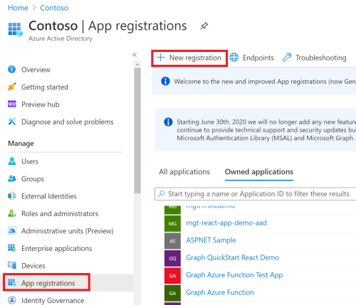
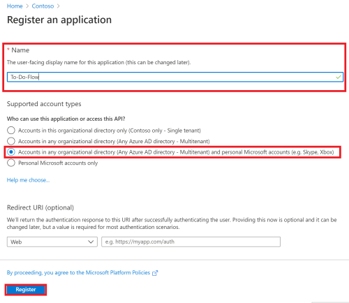
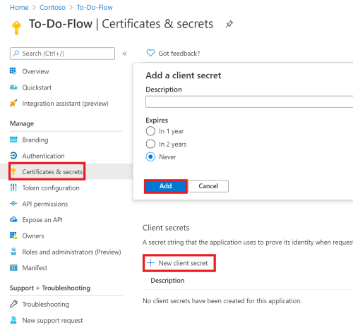
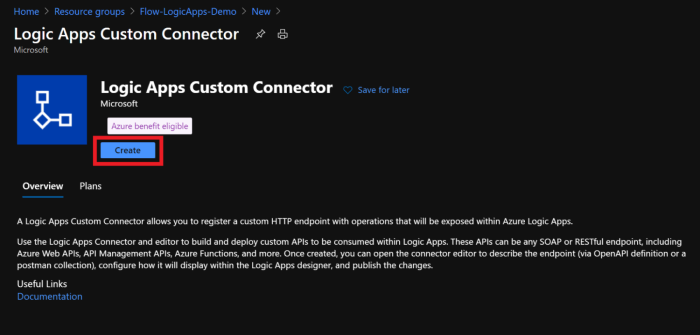
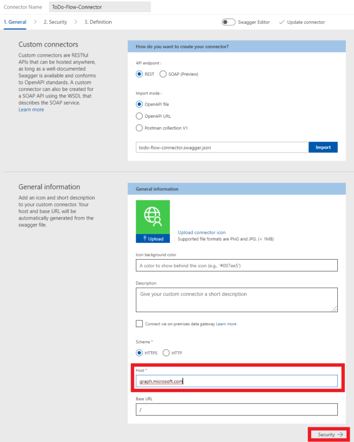
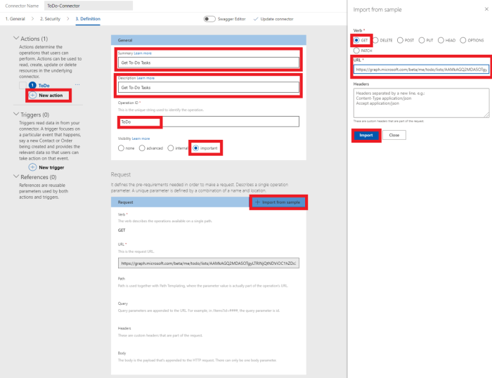
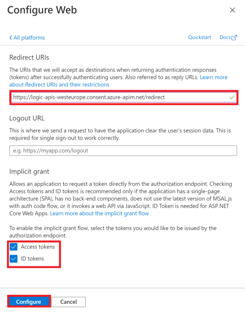

# Get your To-Do tasks ever morning on Microsoft Teams using Azure Logic Apps

I am super excited since [Microsoft Graph To Do APIs](https://docs.microsoft.com/graph/todo-concept-overview?view=graph-rest-beta&WT.mc_id=devto-blog-aycabas) are introduced at Microsoft Build 2020. We finally have APIs available in public preview on the beta endpoint of Graph. 

Just a brief introduction, [Microsoft To Do](https://www.microsoft.com/en-in/microsoft-365/microsoft-to-do-list-app?rtc=1) and [Planner](https://www.microsoft.com/en-us/microsoft-365/business/task-management-software) are the essence of tasks in Microsoft 365. To-Do helps you create a list for anything, from work assignments to school projects to groceries. It is a great tool for your personal use. On the other hand, Planner is the best place to collaborate as a team and keep your team tasks. Tasks come from everywhere, you can keep track of deadlines by adding reminders, due dates, and notes. 

## Wouldn't it be nice to receive your list of assigned tasks every morning on Microsoft Teams? 

Today, we will build a flow using [Azure Logic Apps](https://docs.microsoft.com/azure/logic-apps/?WT.mc_id=devto-blog-aycabas) to automate Microsoft Teams Flow bot for sending To-Do tasks every morning at 9 AM. Here is the steps we will follow:
* Learn the queries and responses about Microsoft Graph To-Do APIs in [Graph Explorer](https://developer.microsoft.com/graph/graph-explorer?WT.mc_id=devto-blog-aycabas)
* Register your app in [Azure Active Directory](https://docs.microsoft.com/azure/active-directory/develop/quickstart-register-app?WT.mc_id=devto-blog-aycabas)
* Build [Azure Logic Apps Custom Connector](https://docs.microsoft.com/azure/logic-apps/custom-connector-overview?WT.mc_id=devto-blog-aycabas) to consume Graph To-Do API and get the tasks
* Create Logic Apps flow to automate sending tasks from Microsoft Teams Flow bot every morning

### Microsoft Graph To-Do APIs in Graph Explorer

To be able to review Microsoft Graph To-Do API queries and responses with your own data, go to [Microsoft Graph Explorer](https://developer.microsoft.com/graph/graph-explorer?WT.mc_id=devto-blog-aycabas) and login with your account from the top left corner by clicking **Sign in to Graph Explorer**.

Then, search for "to do" under **Sample queries** and select **Get my to do task list**. This will run the query `https://graph.microsoft.com/beta/me/todo/lists` and will get all the task lists as a response. Copy one of your preferred task list Id from the response.

Let's try to get all the tasks under your preferred task list. Change the query with the following: `https://graph.microsoft.com/beta/me/todo/lists/{taskListId}/tasks`. Make sure the request is `GET` and hit `Run query`. You should be able to see all tasks under the selected list as a response.

Copy this query and save somewhere, we will use this later while creating a custom connector.

### Register your app in Azure Active Directory

Go to **Azure Active Directory** in [Azure Portal](https://portal.azure.com). Select **App Registrations** and choose **New registation**.

Enter `To-do-flow-app` in the Name field. In the Supported account types section, select **Accounts in any organizational directory and personal Microsoft accounts**. Leave **Redirect URI** blank and choose **Register** to continue.

Go to **API permissions** from the left hand side menu and select **add a permission**. Choose **Microsoft Graph** and **Delegated Permissions**. Select `Task.ReadWrite` and click **Add permission** button.

Go to **Certificates & secrets** from the left hand side menu and select **New client secret** under the **Client secrets**. Choose expiry time and **Add**.  

Copy the `secret` you created and `Application Id` under the **Overview** page. Save them somewhere, we will use them while creating a custom connector.

### Build Azure Logic Apps Custom Connector to consume To-Do APIs in a flow

Go to [Azure Portal](https://portal.azure.com) and create [Logic Apps Custom Connector](https://docs.microsoft.com/azure/logic-apps/custom-connector-overview?WT.mc_id=devto-blog-aycabas).

On the connector configuration, fill the fields as follows:
* **Subscription:** Select an Azure subscription
* **Resource Group:** Create new resource group
* **Custom connector name:** give a name for your custom connector
* **Select the location:** `Region`
* **Location:** Select the preferred location

Choose **Review + create** button to continue.

When your custom connector is successfully created, select `Edit` to configure your connector.

On the connector configuration General page, fill in the fields as follows.

* **Scheme:** HTTPS
* **Host:** `graph.microsoft.com`
* **Base URL:** `/`

Choose **Security** button to continue.

On the **Security** page, fill in the fields as follows.

* **Choose what authentication is implemented by your API:** `OAuth 2.0`
* **Identity Provider:** `Azure Active Directory`
* **Client id:** the application ID you created in the previous exercise
* **Client secret:** the key you created in the previous exercise
* **Login url:** `https://login.windows.net`
* **Tenant ID:** `common`
* **Resource URL:** `https://graph.microsoft.com` (no trailing /)
* **Scope:** Leave blank

Choose **Definition** button to continue.

On the **Definition** page, select **New Action** and fill in the fields as follows.

* **Summary:** `Get To-Do Tasks`
* **Description:** `Get To-Do Tasks`
* **Operation ID:** `ToDo`
* **Visibility:** `important`

Create **Request** by selecting **Import from Sample** and fill in the fields as follows.

* **Verb:** `GET`
* **URL: (paste the query you copied from the Graph Explorer)** `https://graph.microsoft.com/beta/me/todo/lists/{taskListId}/tasks`
* **Headers:** Leave blank
* **Body:** leave blank

Select **Import**.

Choose **Create Connector** on the top-right. After the connector has been created, copy the generated **Redirect URL** from **Security** page.

Go back to Azure Active Directory registered app, go to **Authentication tab** and select **Add platform**, choose **Web**.

Paste the **Redirect URI** you copied from the custom connector under the **Redirect URIs**. Select `Access tokens` and `Id tokens`. Click **Configure** to continue.

### Create Logic Apps flow to automate receiving To-Do tasks
